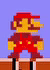
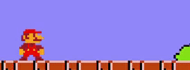

# Super Mario Bros. - AwD-DKN-Edition

- Demo : ([Coming soon!](https ://www.youtube.com/))

# Giới thiệu game

Super Mario Bros. là một trong những tựa game lâu đời nhất của Nintendo, với tựa game bắt đầu nguyên một dòng series nổi tiếng chính là Super Mario Bros. trên hệ máy SNES, đem lại danh tiếng và tiền tài cho Nintendo, biến Mario trở thành nhân vật thương hiệu cho hãng này, với phong cách chạy màn hình ngang trên nền 2D. 

- [Super Mario Bros. - AwD-DKN-Edition](#super-mario-bros.---awd-dkn-edition)
- [Giới thiệu game](#giới-thiệu-game)
- [0. Cách tải game](#0-cách-tải-game)
- [1. Bắt đầu game](#1-bắt-đầu-game)
- [2. Các thành phần trong game](#2-các-thành-phần-trong-game)
- [3. Cách chơi](#3-cách-chơi)
- [4. Chiến thắng và thất bại](#4-chiến-thắng-và-thất-bại)
- [5. Về âm thanh đồ họa của game](#5-về-âm-thanh-đồ-họa-của-game)
- [6. Về source code game](#6-về-source-code-game)

# 0. Cách tải game

**Bước 1 :** Clone repo này về (200 MB).
Hoặc Chọn Code -> Download Zip (53.8 MB).

**Bước 2 :** Cài đặt môi trường. Cài đặt theo hướng dẫn ở mục "Installing the MinGW-w64 toolchain" trong link https ://code.visualstudio.com/docs/cpp/config-mingw.

**Bước 3 :** Bật SMB.exe và chơi.

# 1. Bắt đầu game

- Sử dụng phím **mũi tên lên xuống** trên bàn phím để chọn chơi chế độ *1 người chơi* hoặc *2 người chơi*, sau đó ấn **Enter** để chọn 

- Tuy nhiên, do chế độ *2 người chơi* chưa phát triển nên khi chọn chế độ này màn hình sau sẽ hiện lên.

- Sau đó, hãy bấm phím **Escape (ESC)** trên bàn phím để thoát lại ra màn hình ban đầu và chọn chế độ *1 người chơi* và bắt đầu trải nghiệm game.

- Ngoài ra, bên cạnh chữ **TOP -**    là *kỉ lục* của người chơi.

# 2. Các thành phần trong game :

- **Mario** *(Nhân vật chính)*  : Là nhân vật bạn điều khiển. **Mario** có 3 trạng thái chính :
    * *Thường*  : Trạng thái cơ bản của **Mario**.
    * *Siêu sức mạnh* : Trạng thái **Mario** trở nên *to lớn gấp đôi* về chiều cao, và có thể phá **Tường**.
    * *Bất tử*  : Trạng thái **Mario** sẽ không thể bị hạ trừ khi rơi xuống vực.

- **Goomba** *(Kẻ địch chính)*  : Nhân vật này chỉ có thể đi sang trái phải, nhảy qua vực (nghĩa là **Goomba** sẽ không thể chết trừ khị bị hạ bời Mario. Người chơi có thể hạ **Goomba** bằng cách nhảy lên **Goomba** nhưng hãy cẩn thận vì chỉ cần bị **Goomba** chạm, **Mario** sẽ mất 1 **Mạng** trừ khi **Mario** đang *Bất tử* hoặc khi đang có *Siêu sức mạnh* nhưng khi đó **Mario** trở về trạng thái *Thường* và Bất tử trong khoảng 2 giây.

- **Tường/Gạch** *(Wall/Brick)*  : Là loại đối tượng không thể bị phá với **Mario** *Thường* nhưng có thể bị phá với **Mario** có *Siêu sức mạnh*. Các viên **Gạch** có thể cho ra **Xu** với *tỉ lệ* 1/7 *(14.28%)*.

- **Hộp bí ẩn** *(Question box)*  : Là loại đối tượng không thể bị phá với mọi trạng thái của **Mario**. **Hộp bí ẩn** có thể cho ra các *vật phẩm hỗ trợ* như **Nấm ma thuật, Nấm sinh mệnh, Ngôi sao, Xu** hoặc không có gì tuỳ theo vị trí của **Hộp bí ẩn**. Một khi **Hộp bí ẩn** được mở, sẽ trở thành  một đối tượng **bình thường** không có chức năng đặc biệt.

- **Nấm ma thuật** *(Magic Mushroom)*  : Là loại nấm khi **Mario** ăn sẽ tiến vào trạng thái *Siêu sức mạnh*, trở nên *Bất tử* trong khoảng *3 giây*.

- **Nấm sinh mệnh** *(1 Up Mushroom)*  : Là loại nấm khi **Mario** ăn sẽ được thêm 1 **Mạng**.

- **Ngôi sao** *(Starman)*  : Là loại đối tượng sau khi **Mario** ăn, trong vòng 6 giây sẽ trở nên *Bất tử*, và tăng tốc gấp 5/3 *(1.67%)* lần.

- **Xu** *(Coin)*  : Là loại đối tượng **Mario** không cần phải ăn, khi xuất hiện sẽ tăng lượng **Xu** đang có thêm 1. 

- **Lâu đài** *(Castle)* : Xuất hiện ở cuối bản đồ, là đích của trò chơi.

- **Tên và Điểm** *(Name and Score)* (res/preview/name_score.png) : Xuất hiện ở góc bên trái trên cùng của màn hình, hiển thị tên và điểm của người chơi. Cách tính điểm :
    * Hạ **Goomba**  : Được thêm **100 Điểm**.
    * Ăn **Nấm ma thuật**  : Được thêm **1000 Điểm**.
    * Ăn **Ngôi sao**  : Được thêm **1000 Điểm**.
    * Nhận **Xu**  : Sau khi chiến thắng, được thêm **50 Điểm** ứng với mỗi **Xu** sở hữu.
    * Phá **Tường**  : Được thêm **200 ~ 400 Điểm** ứng với mỗi ô **Tường** bị phá.
    * **Thời gian** còn lại : Sau khi chiến thắng, được thêm **100 Điểm** ứng với mỗi **giây** còn dư.

- **Thời gian** *(Time)*  : Xuất hiện ở góc bên phải trên cùng của màn hình. **Thời gian** tối đa một lần chơi là **300 giây**, người chơi sử dụng thời gian càng ít để về đích **Điểm** tổng sẽ càng cao, nhưng nếu sau **300 giây** không thể về đích, **Mario** sẽ được tính là bị hạ.

- **Mạng** *(Lives)*  : Xuất hiện bên phải **Tên và Điểm**, hiển thị số mạng còn lại của người chơi, khi bắt đầu chơi, **Mario** có sẵn 3 **Mạng**, nhưng có thể thêm **Mạng** trong quá trình chơi. Khi hết mạng, **Mario** sẽ được tính là bị hạ, người chơi sẽ phải chơi lại từ đầu.

- **Bố cục game cơ bản :**

# 3. Cách chơi

Di chuyển tiến lên phía trước, sử dụng *vật phẩm hỗ trợ* một cách tối ưu và đi tới **Lâu đài** mà không bị hạ.

Sử dụng phím **mũi tên trái phải** trên bàn phím để di chuyển trái phải.

    
+ Khi bấm đồng thời 2 phím **trái phải** **Mario** sẽ ngay lập tức dừng lại.

Sử dụng phím **mũi tên lên** trên bàn phím để nhảy.

Sử dụng phím **mũi tên xuống** trên bàn phím để ngồi khi **Mario** có *Siêu sức mạnh*.

+ Khi đang ngồi rồi đứng lên cũng có thể phá **Tường**.

Sử dụng phím **ESC** trên bàn phím để *tạm dừng*.

Sử dụng phím **K** trên bàn phím để *tự tử*.

# 4. Chiến thắng và thất bại

- Bạn sẽ chiến thắng nếu đi đến **Lâu đài** mà không chết (tuy nhiên khi màn hình chưa chuyển sang **YOU WON**, **Mario** vẫn có thể chết).

- Bạn sẽ thất bại nếu số **Mạng** = 0, đồng thời không được tính điểm.

# 5. Về âm thanh đồ họa của game :

Sử dụng trên Internet và có chỉnh sửa đôi chút.
Nguồn :
+ https ://github.com/Kofybrek/Super-Mario-Bros/tree/Main
+ https ://www.spriters-resource.com/search/?q=mario
+ https ://www.spriters-resource.com/nes/supermariobros/sheet/50365/
+ https ://nesmaps.com/maps/SuperMarioBrothers/SuperMarioBrothers.html
+ https ://themushroomkingdom.net/media/smb/wav

# 6. Về source code game :

- Folder **_include_** :
    * folder **_headers_** : chứa các headers do tôi tạo ra chứa các class, cấu trúc được dùng trong game.
      + **defs.h :** Thêm các thư viện cần thiết của SDL và #define các biến của hệ thống game.
      + **structs.h :** Thêm các cấu trúc phụ như *Vector2i, Vector2f, Stage,...*.
      + **render_window.h :** Chứa các hàm khởi tạo SDL và huỷ SDL.
      + **game.h :** Chứa class **Game**, là class tổng hợp và chưa game loop chính của game.
      + **main.h :** Chứa thứ viện cần thiết cho *main.cpp*
      + **timer.h :** Chứa class **Timer** để xử lý về thời gian để cố định FPS cho game và sử dụng vào việc tính thời gian.
      + **menu.h :** Chứa class **Menu** để khởi tạo và xử lý màn hình chờ, tạm dừng, kết thúc.
      + **map.h :** Chứa class **Map** để tải bản đồ và xử lý hiển thị các đối tượng trên bản đồ.
      + **entity.h :** Chứa class **Entity**, là class cơ bản đại diện cho các đối tượng trong game.
      + **text.h :** Chứa class **Text**, kế thừa từ class **Entity** để xử lý việc khởi tạo, hiển thị văn bản.
      + **score_manager.h :** Chứa class **Score_Manager**, kế thừa từ class **Text** xử lý việc hiển thị điểm khi nhận vật phẩm.
      + **character.h :** Chứa class **Character**, kế thừa từ class **Entity** để tạo và quản lý nhân vật chính **Mario**.
      + **enemy.h :** Chứa class **Enemy**, kế thừa từ class **Entity**, khởi tạo và xử lý một số biến và hàm chung của các kẻ địch (hiện tại chỉ có **Goomba**, nhưng sẽ được phát triển thêm trong tương lai).
      + **goomba.h :** Chứa class **Goomba**, kế thừa từ class **Enemy** để tạo và quản lý nhân vật **Goomba**.
      + **items.h :** Chứa class **Items**, kế thừa từ class **Entity**, khởi tạo và xử lý một số biến và hàm chung của các vật phẩm hỗ trợ.
      + **mushroom.h :** Chứa class **Mushroom**, kế thừa từ class **Items**, khởi tạo và xử lý, hiển thị **Nấm ma thuật, Nấm sinh mệnh**.
      + **starman.h :** Chứa class **Starman**, kế thừa từ class **Items**, khởi tạo và xử lý, hiển thị **Ngôi sao**.
      + **coin.h :** Chứa class **Coin**, kế thừa từ class **Items**, khởi tạo và xử lý, hiển thị **Xu**.
      + **flag.h :** Chứa class **Flag**, kế thừa từ class **Items**, khởi tạo và xử lý, hiển thị **Lá cờ** khi **Mario** về đích.

    * Folder **_sdl_** : chứa các *headers* của thư viện *SDL.h, SDL_mixer.h, SDL_image.h, SDL_ttf.h*.

- Folder **_lib_** : chứa các *library* của thư viện SDL2, SDL_mixer, SDL_image, SDL_ttf.

- Folder **_map_** : Chứa *file* map.dat, lưu trữ bản đồ của game dưới dạng số :
    * **0** là **Trống**
    * **1** là **Đất**
    * **2** là **Tường**
    * **3** là **Hộp bí ẩn**
    * **4** là **Chướng ngại vật**
    * **5** là **Mây**
    * **6** là **Cỏ**
    * **7** là **Núi**
    * **8** là **Ống**
    * **9** là **Ô hỗ trợ (Ô tàng hình)**
    * **13** là **Hộp bí ẩn sau khi được mở**
    * **19** là **Lâu đài**

- Folder **_font_** : chứa *font* chữ dùng trong game.

- Folder **_res_** : chứa các *tài nguyên* dùng trong game :
    * Folder **_image_** : chứa các *texture* của các nhân vật, đối tượng, ... và các ảnh khác dùng trong game.
    * Folder **_sound_** : chứa các file âm thanh dùng trong game.
    * Folder **_preview_** : chứa các file ảnh dùng để *preview game* trong README.md.
- Folder **_src_** : chứa các file *mã nguồn .cpp* định nghĩa các phương thức của các class trong các file *headers* và file *main.cpp* và file *high_score.txt* lưu trữ kỉ lục của người chơi.

